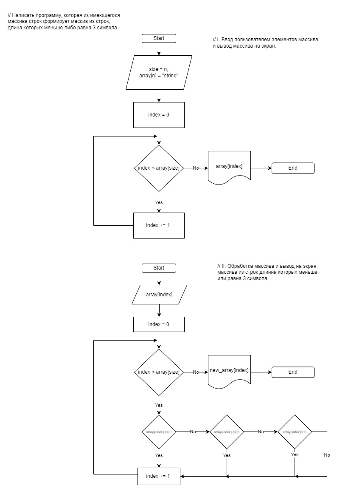

## **ИТОГОВАЯ ПРОВЕРОЧНАЯ РАБОТА.**   

### ЗАДАЧА :
---
*Написать программу, которая из имеющегося массива строк формирует массив из строк, длина которых меньше либо равна 3 символа. Первоначальный массив можно ввести с клавиатуры, либо задать на старте выполнения алгоритма. При решение не рекомендуется пользоваться коллекциями, лучше обойтись исключительно массивами.*
---
   
## Техническое задание (ТЗ):

1. Создать репозиторий на GitHub
2. Нарисовать блок-схему алгоритма
3. Снабдить репозиторий оформленным текстовым описанием решения (файл README.md)
4. Написать программу, решающую поставленную задачу
5. Использовать контроль версий в работе над этим небольшим проектом (не должно быть так, что все залито одним коммитом, как минимум этапы 2, 3 и 4 должны быть расположены в разных коммитах)  

### Задание 1. Создание реппозитория на GitHub.
---
* Ссылка на реппозиторий - [GitHub](https://github.com/William-J-Butcher/CS_FinalTask)
  
### Задание 2. Создание блок-схемы алгоритма решения задачи
---
   

### Задание 3. Описание алгоритма решения задачи
---
1) Пользователь указывает массив какой длинны (n) он хочет создать и заполняет массив элементами в цикле n-раз.
2) Затем, в цикле проходим по созданному пользователем массиву и проверяем, подходит ли элемент условию задачи - "длина символов <= 3". Если элемент подходит под данное условие, то добавляем его в новый массив.
3) После чего вывадим оба массива на экран.  

### Задание 4. Решение задачи на C#
---
В папке Task решение задачи на C# согласно условию задачи и техническому заданию.

